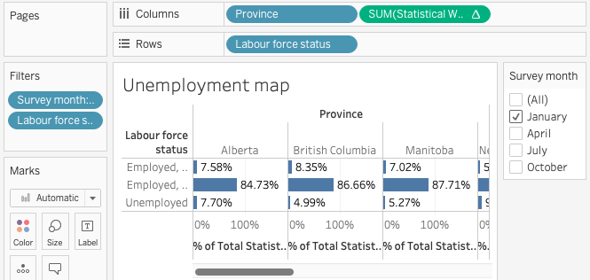
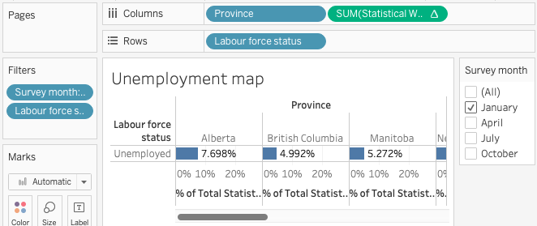
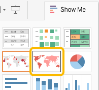
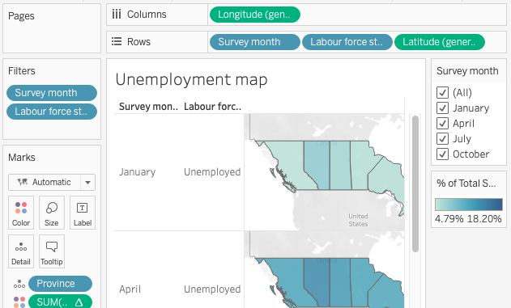
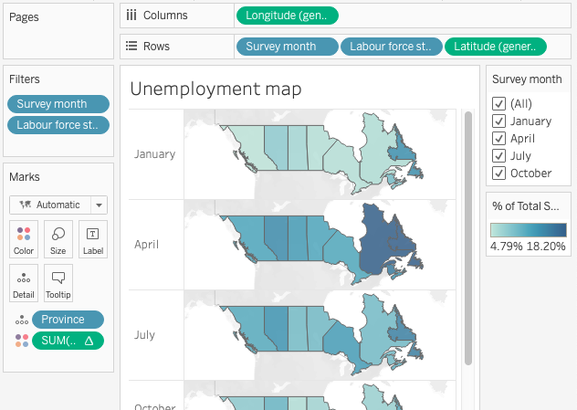

# Creating graphs: part 2
In this section we will build on the previous graph to show differences over time and by province. In the process you will explore some other Tableau features.

- **Hide** elements in a graph
- Use **Show Me** to change graph type
- **Show/Hide** headers
- Change **Color**
- Edit **Tooltip**

## Map: unemployment rate by month and province
You can add complexity or depth to a graph by adding other dimensions or measures to the worksheet. This is a great way to explore your data and Tableau features.

### *1*{: .circle .circle-yellow} Add provinces
Duplicate the unemployment rate bar graph on a new worksheet, then make changes.

1. Right-click the "Unemployment rate" tab and select _Duplicate_
1. Right-click the new tab and _Rename_ it _Unemployment map_
1. Drag _Province_ onto the _Columns_ shelf
{: .step}

### *2*{: .circle .circle-yellow} Hide unwanted information
With more dimensions the graph it can get cluttered. We're only interested in the unemployment rate and can make it easier to read by removing the other two categories.

In the "Labour force status" column, right-click each of the two "Employed..." labels and select _Hide_.
{: .step}

_Hide_ and _Exclude_ behave differently. _Exclude_ removes the corresponding data from the graph and adds a filter to the _Filters_ card. This also removes the data from calculations, which would affect our unemployment rate calculations. If the content you wish to hide from view is used in a calculation choose _Hide_ instead of _Exclude_.
{: .note}

### *3*{: .circle .circle-yellow} Change graph type
When your data contains geographic names or coordinates Tableau can represent it on a map. 

Click the _Show Me_ button in the top right corner and select the shaded map. The _Show Me_ menu indicates which chart types can be used with the measures and dimensions on your worksheet. 

{: .step}

### *4*{: .circle .circle-yellow} Show other months 
The map displays information in a smaller space, making it possible to show more information such as change over time.

1. Drag _Survey month_ to the _Rows_ shelf, placing it before _Labour force status_
1. Select _All_ in the _Survey month_ filter
{: .step}

### *5*{: .circle .circle-yellow} Format for tidier display
As you add elements to the chart it can become cluttered. If the information is not important to understanding the graph, consider removing it and formatting the display for your needs.

1. On the _Rows_ shelf, right-click _Labour force status_ and select _Show Header_ to toggle visibility of the "Unemployed" column
1. Hover over the row and column dividers and drag them to change the map size, if desired
{: .step}

## Exercise
With the _Marks_ card you can format many aspects of a graph. Try one or more of the following:

1. Change the _Colors_ 
2. Simplify or customize the _Tooltip_
3. Add labels to the map showing maximum and minimum unemployment rates each month
