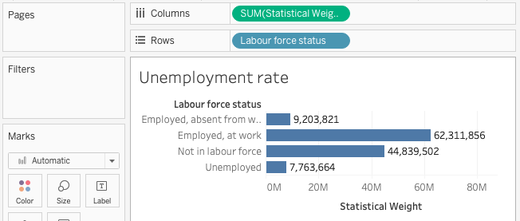

# Creating graphs: part 1
Tableau is sophisticated software with _many_ features. In this introductory workshop we will cover a small number of features as we create two graphs:

- Add **labels**
- **Filter** the data displayed
- Use **calculations**
- **Group** values
  
The measure named _Statistical Weight_ is the number of people in the total population represented by each row. The sum of the _Statistical Weight_ field for a given month represents the Canadian population covered by the survey, "the non-institutionalized population 15 year of age and over" (see the [Guide to the Labour Force Survey](https://www150.statcan.gc.ca/n1/pub/71-543-g/71-543-g2020001-eng.htm) for details).
{: .note}
 
## Bar graph: unemployment rate
The data in the sample dataset is the same used to produce Statistics Canada table 14-10-0017-02, [Labour force characteristics by province, monthly, unadjusted for seasonality](https://www150.statcan.gc.ca/t1/tbl1/en/tv.action?pid=1410001702). We can use Tableau to reproduce the figures in the Statistics Canada table and present them visually.

### *1*{: .circle .circle-yellow} The foundation: adding dimensions and measures

1. Go to _Worksheet -> New Worksheet_
1. Right-click the new worksheet tab (bottom of the screen) and _Rename_ the sheet to "Unemployment rate"
1. Drag _Labour Force Status_ to _Rows_
1. Drag _Statistical weight_ to _Columns_ 
{: .step}

**Tip:** An alternative to dragging dimensions/measures to the sheet is to _double-click_ the dimension/measure name.  

### *2*{: .circle .circle-yellow} Adding labels
There are at least two ways to add labels showing the sum of _Statistical Weight_ for each _Labour force status_:

Open the _Analysis_ menu and select _Show Mark Labels_, **OR**  
In the _Marks_ card, click _Label_ then put a check next to _Show mark labels_
{: .step}

### *3*{: .circle .circle-yellow}Add a filter
We now have a bar graph showing an estimate of the population  in each Labour Force Status category. But this number is four times too high because we have four months of data. To see the number of unemployed people in a single month, limit to January survey responses in one of two ways:

Right-click _Survey month_ and select _Show Filter_, **OR**  
Drag _Survey month_ onto the _Filters_ card
{: .step}

### *4*{: .circle .circle-yellow}Show as percentage of total
We are interested in the unemployment _rate_ which is represented as a percentage of the population, but our labels show the actual population. To show percentages instead of sums:

Right-click the green _Statistical Weight_ pill in the _Columns_ shelf and select _Quick Table Calculation -> Percent of Total_
{: .step}

## Exercise
The unemployed row shows 3.77% but this is not actually correct: Statistics Canada unemployment rate calculations exclude people "Not in labour force."  

Take a moment to explore and see if you can solve this problem. What is the actual unemployment rate for January 2020?

<u>Click here for solutions</u>

<strong>Solution 1:</strong> on the bar graph, right click the label "Not in labour force" and select <em>Exclude</em>. (Notice that this adds a new <em>Labour force status</em> filter to to the <em>Filters</em> card.)

<strong>Solution 2:</strong> drag the<em>Labour Force Survey</em>dimension from the left menu to the<em>Filters</em>card and exclude "Not in labour force".

Canada's unemployment rate for January 2020 was <strong>5.84%</strong>

