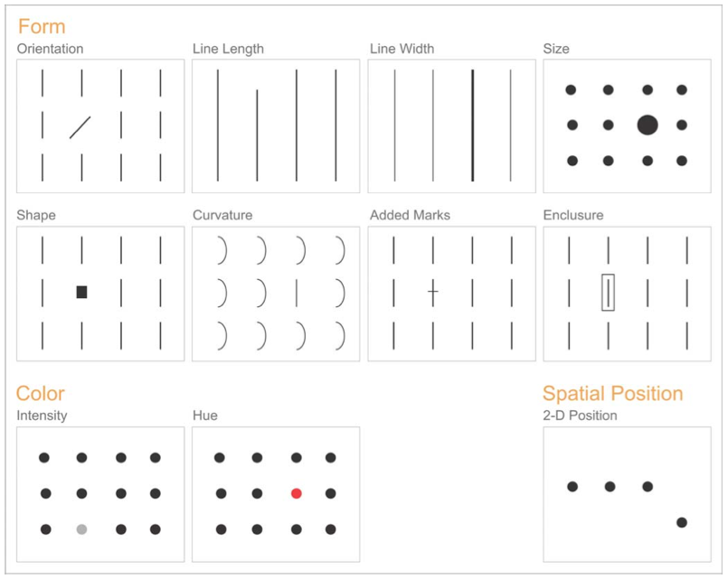
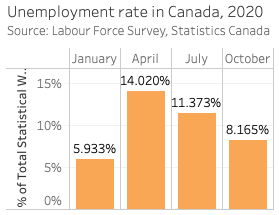
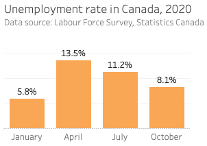
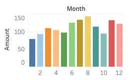

# Visualization basics
>"Data visualization is the graphical display of abstract information for two purposes: sense-making (also called data analysis) and communication."  

>   -_Stephen Few, [What is Data Visualization](https://www.perceptualedge.com/blog/?p=2636)_

This workshop emphasizes the role data visualization plays in the two activities identified above. Visualization makes it easier to explore and understand what's going on in our data, fulfilling the **sense-making** purpose. It can also improve the **communication** of our findings by drawing attention to the patterns, relationships, and stories we choose to highlight.

Data visualizations are often attractive, but it isn't primarily their visual appeal that makes them work. A chart or graph that communicates effectively taps into the processes of perception and cognition. To create and recognize good visualizations it will help to understand a few concepts.

## Preattentive processing
The first is **preattentive processing**, which refers to the eye and brain's ability to process certain visual properties almost instantly, without conscious effort. Good graphs take advantage of this perceptual ability to make information almost immediately apparent with little cost to the viewer. This figure shows the preattentive visual attributes that are especially useful when visualizing data.

_Source: Stephen Few, "Tapping the Power of Visual Perception" <http://www.perceptualedge.com/articles/ie/visual_perception.pdf>_

In the figure above it is easy to spot the differences: some of them pop out almost instantly, with no need to concentrate or look closely. When creating visualizations we can take advantage of these preattentive attributes to encode information, often using more than one attribute in the same graph.

It is also clear from the figure that preattentive attributes have different powers. Some stand out more than others, and some can be used not only to distinguish _between_ things (like shape), but to show differences in _amount_ (like length). All of this may sound obvious, but that is precisely the point: by using visual cues that are obvious to most viewers we make it easier for them to see - and hopefully understand - the messages we want our visualizations to convey.

## Encoding quantities with length
Length and size are two preattentive attributes often used to represent quantities. In a bar graph the length of the bars correspond to the quantity of the represented measure. Similarly, in a pie chart quantities are represented by the relative size of each slice. 

Length is usually a better choice for encoding quantities. It is easier to determine at a glance whether one bar is longer than another than to compare similar slices of a pie graph. It is also easier to see _how much_ difference there is between two quantities when they are encoded using length.

## Reducing distractions
When using visualizations to communicate it is good practice to remove elements that are not required to convey your message. Additional labels, lines, and decimal points compete for the viewers attention and can distract from what matters most in a visual display. It is important to provide enough detail for the viewer to orient themselves and understand the graph, but removing unecessary components provides more breathing room and helps the viewer focus on the content.

In the version on the right, removing redundant text and changing text shading, placement, and size draws attention to the main content: unemployment rates. Unecessary lines are also removed. The light horizontal lines are sometimes helpful when scanning across a graph and were kept, but even these might not be necessary in all cases. 

In your own work review each visual component and ask whether it helps keep the viewer focused. The "less is more" rule often leads to clearer visualizations.

## Using color with intention
Use colors intentionally to encode information, call attention to certain elements, or highlight relationships within or between visualizations. 
 
- **Colorblindness**. Avoid encoding important information in colors that may be difficult for some viewers to perceive. See [5 tips on designing colorblind-friendly visualizations](https://www.tableau.com/about/blog/2016/4/examining-data-viz-rules-dont-use-red-green-together-53463).
- **Visual continuity**. A dashboard or report may contain several visualizations based on the same data. If the same category appears in several graphs use the same color scheme to depict it throughout. This will make it easier for viewers see the relationship among your graphs.
- **Meaningful encoding**. The colors on the left below do not encode any new information and add distracting visual complexity to the graph. By not "spending" colors unnecessarily designers can use them to greater effect (e.g. to call attention to a particular value).

## Some guiding principles 
1. **Choose clarity over variety**  
Visual variety can be appealing, but ensure that it also serves the communicative and sense-making purposes of your visualizations.
2. **Reduce burden on the reader**  
The twin graphs above illustrate this point. Avoid distractions and unecessary information and help the reader focus on the content.
3. **Present data with integrity**  
We increase the credibility and integrity of our work by citing data sources and avoiding intentionally misleading displays. (For more about this see Alberto Cairo's book [_How charts lie : getting smarter about visual information._](http://resolve.library.ubc.ca/cgi-bin/catsearch?bid=10081648))
