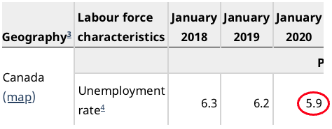
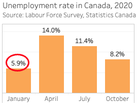

# Preparing your data
This workshop emphasizes the visualization but in many cases your data will need to be manipulated, reformatted, and re-packaged _before_ you feed it to a visualization tool. Tableau (and other visualization tools) have some features to help clean messy data, but here are some general things to consider when preparing your data.

[OpenRefine](https://openrefine.org) is a powerful open source tool for working with messy data. If you are familiar with the _R_ programming language, [Tidyverse](https://www.tidyverse.org/packages/) packages like _dplyr_ and _tidyr_ are also useful.
{: .note}

## Each measure in one column
If you're working with tabular data (e.g. Excel, csv), format it so that each measure appears in one column only. A table like this...

|  | march | april | may | june | july |
| --- | :---: | :---: | :---: | :---: | :---: |
| kittens_adopted | 0 | 0 | 1 | 0 | 2 |
| meals_ordered | 8 | 11 | 17 | 13 | 23 |

...will be harder to work with and will have fewer visualization options than this table with the same information:

| month | kittens_adopted | meals_ordered |
| --- | :---: | :---: |
| march | 0 | 8 |
| april | 0 | 11 |
| may | 1 | 17 |
| june | 0 | 13 |
| july | 2 | 23 |
 

## Remove non-data content
Excel worksheets often begin with titles and other information, with the actual data starting below. Subtitles and empty lines within the data table may further interfere with visualization software's ability to interpret the contents. Removing extra lines and non-data content is a good general practice, though Tableau can often identify the data elements correctly during import.

## Know your dataset
It's important to know a few things about your data before importing it. How many records are there? What are the variable labels? Knowing this will help you confirm that Tableau imported the data correctly.

The sample dataset for this workshop contains four months of data from the Statistics Canada Labour Force Survey (Jan, Apr, Jul, and Oct 2020). This data and supporting documentation is freely available from UBC Library's [Abacus data repository](https://hdl.handle.net/11272.1/AB2/GGXMM2) under the terms of the [Statistics Canada Open License](https://www.statcan.gc.ca/eng/reference/licence). Statistics Canada's [Guide to the Labour Force Survey](https://www150.statcan.gc.ca/n1/pub/71-543-g/71-543-g2020001-eng.htm) provides information about the survey purpose, methodology, and terms.

To make it easier to work with in Tableau the sample dataset is a modified subset of the original data. Some variables were excluded and variable names and values were replaced with descriptive labels (see the [Resources](resources.html) page for details about the changes). The dataset contains 360,554 observations of 23 variables:

- Actual hours worked/wk at main job
- Age group
- Census metropolitan area
- Class of worker (main job)
- Duration of unemployment
- Flows into unemployment
- Highest educational attainment
- Job permanency (employees only)
- Labour force status
- Occupation at main job
- Province
- Reason for leaving job
- Reason for part time work
- Record number
- Sex
- Single or multiple jobholder
- Statistical Weight
- Student status
- Survey month
- Survey year
- Type of work (main job)
- Usual hourly wages (employees only)
- Usual hours worked/wk at main job

## Checking your work
If you know your data it's easier to spot when something's not quite right, suggesting a setting or calculation is incorrect. The sample dataset is the same one used to generate Statistics Canada table [14-10-0017-02](https://www150.statcan.gc.ca/t1/tbl1/en/tv.action?pid=1410001702), _Labour force characteristics by province, monthly, unadjusted for seasonality_. As you learn Tableau you may use this table to check your work.

<h3>Statistics Canada table</h3>

<h3>Graph produced from sample dataset</h3>

