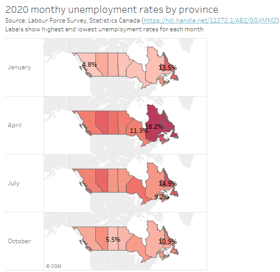

# Outline 

| 0:00 | Introduction and setup 
| 0:10 | [Visualization basics](introduction.html)
| 0:25 | [Preparing your data](preparing_data.html)
| 0:30 | [Introducing the Tableau interface](tableau-interface.html)   
| _0:45_ | _Break_
| 0:50 | [Creating graphs](creating-graphs.html)
| 1:20 | [Saving your work](saving.html)
| 1:25 | Conclusion 

_(Times and content may vary)_

In this workshop we begin with a dataset in CSV format containing 360,554 rows of data from Statistics Canada about labour and employment in Canada for selected months in 2020. By the end you will be able to create simple, clear graphs from the data like this map of unemployment rates. 

